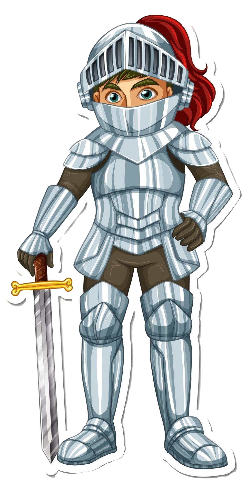

# Preux chevalier

{ align=left width="120"}

**Description du rôle** : Noble et courageux, il est l’image parfaite de la chevalerie, mais souvent un peu rigide ou aveuglé par ses idéaux.

**Voix** : Grave, posée, et toujours emplie de noblesse. Parfois grandiloquente dans ses discours.

**Corps** : Démarche assurée et fière, posture droite comme une épée ; il gesticule avec un certain cérémonial.

**Vêtements** : Une armure étincelante ou une cotte de mailles, avec un tabard aux couleurs de sa maison. Il porte une épée et un bouclier ornés.
